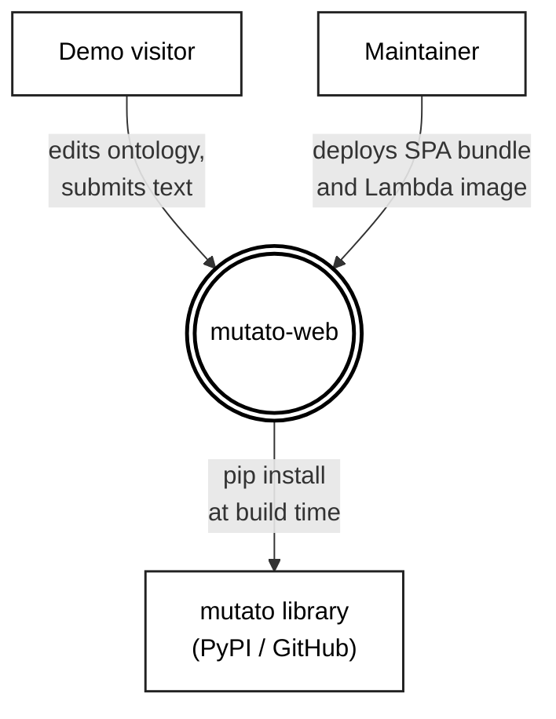

# Context diagram: mutato-web

Level-0 view in the classic Yourdon / DeMarco data-flow style. The system is a single bubble in the center. External entities are rectangles. Arrows are labeled with what flows between them. No internal structure is shown. For internal structure, see `containers.md`.

## Notation

| Shape | Meaning |
|---|---|
| Double-circle (bubble) | The system in scope |
| Rectangle | An external entity: a person, an organization, or another system |
| Labeled arrow | A flow of data, control, or dependency. The label says what flows; the arrowhead says which way |

## Boundary choices

What is deliberately not on this diagram:

- **AWS S3, Lambda, API Gateway, ECR.** Runtime substrate, not external entities that mutato-web exchanges data with. They belong in a deployment view.
- **`en_core_web_sm` (spaCy model).** Bundled inside the Lambda image. Internal to mutato-web at this level.
- **Browser.** The visitor uses one, but drawing the browser as a separate box adds noise without sharpening scope.

## When to update this diagram

Update when any of the following changes:

1. A new class of user appears (for example, an authenticated API caller separate from the demo visitor).
2. A new external entity enters the runtime path (a real auth provider, a billing API, a different upstream library).
3. The maintainer deploy path changes substantively (for example, replacing the manual `aws s3 sync` flow with CI/CD).
